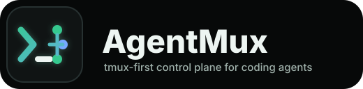
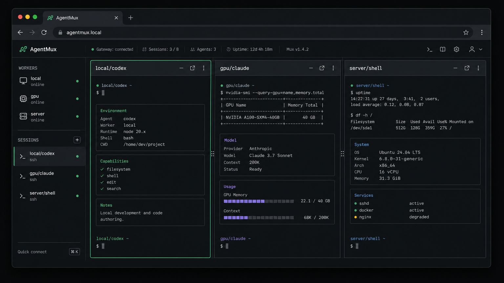
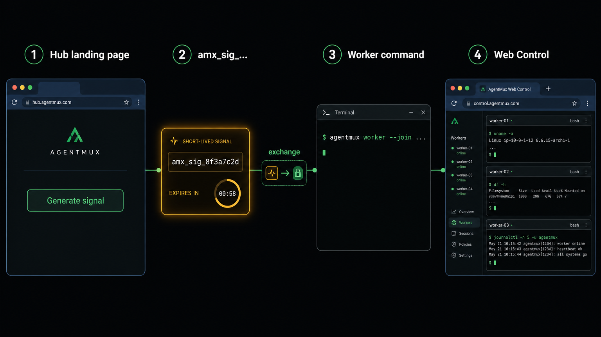

<p align="center">
  
</p>

# AgentMux

[English](README.md) | [中文](README.zh-CN.md)

AgentMux is a terminal-backend control plane for long-lived coding-agent sessions.
It is designed as one Go binary with three roles:

- `hub`: public HTTPS/WSS entrypoint and routing layer.
- `worker`: outbound connector that manages local tmux or built-in PTY sessions.
- `control`: CLI client for listing, creating, attaching, and sending input.
  The product control surface is the hub-hosted browser page at `/control`.

The agent is intentionally unaware of AgentMux. Codex, Claude, Gemini, OpenCode,
or a shell simply run inside a local terminal backend. Worker observes and
controls that terminal layer.


## Quick Start

AgentMux clients default to the public Hub at `https://agentmux.kinboy.wang`
when no Hub is configured locally:

```bash
agentmux-tui
agentmux worker join --join 'amx_sig_...' --name "$(hostname)"
```

Use `--hub` or `AGENTMUX_HUB`/`AGENTMUX_CONTROL_HUB` to target a private Hub.

If you are already viewing an AgentMux Hub landing page, use that Hub directly:

1. Click `Generate join signal`.
2. Run the generated Worker command on the machine that owns your sessions.
3. Open the generated Web Control share URL from your browser, or copy the
   Direct Token into Web Control / TUI.

To self-host a Hub, run the published container image:

```bash
docker run -d --name agentmux --restart unless-stopped -p 8081:8081 ghcr.io/kinboyw/agentmux:latest
```

The container stores Hub state under `/var/lib/agentmux` by default. Mount that
directory only when you want to persist the embedded database outside the
container.

If the self-hosted Hub does not already have a public URL, put it behind
Cloudflare Tunnel, ngrok, or another reverse proxy first, then open the public
URL and generate Worker and Control commands from that page.

For local source verification:

```bash
./scripts/dev-tmux.sh
```

This starts Hub, Worker, and Control panes in one tmux session. The default port
is `8081` and the default token is `dev-token`.

Project Go version is managed by mise:

```bash
mise install
mise exec -- go test ./...
```

Installed binaries expose build metadata and a conservative updater:

```bash
agentmux version
agentmux update check --role control
agentmux update apply --role control
agentmux run control@latest
```

`update apply` verifies the release checksum, stages the new binary, and keeps a
rollback pointer. Docker Hub deployments should update by replacing the
container image instead of mutating binaries inside the container.

Web Control checks Hub build metadata and prompts for a refresh when new browser
assets are available. Worker cards can queue a remote Worker update when the
Worker is online and advertises the `worker.update.apply` capability; tmux
sessions remain alive across the Worker restart.

The browser UI uses xterm.js for the terminal area and keeps session identity,
connection state, and detach controls outside the remote terminal buffer.
The modern Web control source lives in `web/control` and is embedded into the
Hub from `internal/hub/webdist`.

The Web control supports two access modes:

- Registered account mode for full Hub management: create/join sessions, manage
  Workers, update Workers, use previews, and keep a refreshable browser
  credential.
- Direct Token mode for anonymous sharing: connect to the shared tenant, view
  the session list, and switch between session terminals. Direct Token mode
  intentionally cannot create sessions, generate new join signals, manage
  Workers, use previews, or trigger updates.

Register or sign in from the sidebar to receive a scoped `amx_cred_...` control
credential. When Hub runs with `--data`, users, signals, credentials, and device
auth state are persisted in SQLite. Without `--data`, Hub uses the development
in-memory store. GitHub and Google buttons are wired to OAuth provider
endpoints, but providers are not configured yet.



Persistent Hub mode uses SQLite:

```bash
agentmux hub \
  --addr 0.0.0.0:8080 \
  --data ./agentmux.db \
  --public-url https://hub.example.com
```

`--data` persists signals, credentials, and registered users. Online workers,
active WebSocket streams, and live session snapshots are runtime state and are
rebuilt as workers reconnect. `--public-url` is the external URL that Hub uses
when it generates Worker, Control, and landing-page commands.

Cloudflare named tunnel example:

```bash
agentmux hub --addr 127.0.0.1:8080 --data ./agentmux.db --public-url https://hub.example.com
cloudflared tunnel run agentmux
```

Cloudflare terminates HTTPS and forwards WebSocket upgrades to the Go Hub. The
Hub generates `wss://...` worker URLs automatically when the public URL is
HTTPS.

For a quick `trycloudflare.com` tunnel, run `cloudflared tunnel --url ...`
first, copy the printed URL, then restart Hub with that value as `--public-url`.


See [Deployment](docs/DEPLOYMENT.md) for Docker Compose, systemd, Cloudflare
Tunnel, and release install script details.

Docker images are published to GitHub Container Registry on release tags:

```bash
docker pull ghcr.io/kinboyw/agentmux:latest
```

Signal and Direct Token onboarding:

1. Open `http://127.0.0.1:8081/`.
2. Generate a signal.
3. Run the generated Worker command.
4. Open the generated Web Control share URL, or copy the Direct Token into Web
   Control / `agentmux-tui --token`.

Signals look like `amx_sig_...` and are exchanged for scoped `amx_cred_...`
credentials before normal API or WebSocket access.
The generated Direct Token is already a scoped Control credential and is limited
to simple shared-session access.



Manual source-development commands:

Terminal 1:

```bash
go run ./cmd/agentmux hub --addr 127.0.0.1:8080 --token dev-token
```

Terminal 2:

```bash
go run ./cmd/agentmux worker --hub ws://127.0.0.1:8080 --token dev-token --name local
```

Terminal 3:

```bash
go run ./cmd/agentmux control list --hub http://127.0.0.1:8080 --token dev-token
go run ./cmd/agentmux control create --hub http://127.0.0.1:8080 --token dev-token --worker local --name demo --cwd "$PWD" --command bash
go run ./cmd/agentmux control attach --hub ws://127.0.0.1:8080 --token dev-token --session local/demo
```

In `control attach`, press `Ctrl-]` to detach from the local control session.
This only closes the local control connection; the worker-side session remains
alive. `Ctrl-C` is forwarded to the remote agent.

Windows Hub-only convenience startup:

```bat
scripts\run.bat
```

The script starts a local Hub on `127.0.0.1:8081` with
`--public-url https://agentmux.kinboy.wang`. Edit the script for a different
domain or port.

## Build And Release

CI runs Go tests, builds the Web Control, and builds role-specific binaries
through GitHub Actions. Tag pushes like `v0.1.0` trigger Linux/macOS Worker and
Control assets, plus cross-platform Hub assets including Windows hub-only
builds.

Local release-style build:

```bash
cd web/control
npm ci
npm run build
cd ../..
rm -rf internal/hub/webdist
mkdir -p internal/hub/webdist
cp -a web/control/dist/. internal/hub/webdist/
mise exec -- go build -o dist/agentmux ./cmd/agentmux
```

## Documents

- [Design](docs/DESIGN.md)
- [Usage](docs/USAGE.md)
- [Product Architecture](docs/PRODUCT_ARCHITECTURE.md)
- [In-Place Update Strategy](docs/UPDATE_STRATEGY.md)
- [API](docs/API.md)
- [Deployment](docs/DEPLOYMENT.md)
- [Roadmap](docs/ROADMAP.md)
- [Visual Prompt Library](docs/visual-prompts/README.md)
- [GitHub Repository Metadata](docs/GITHUB.md)
