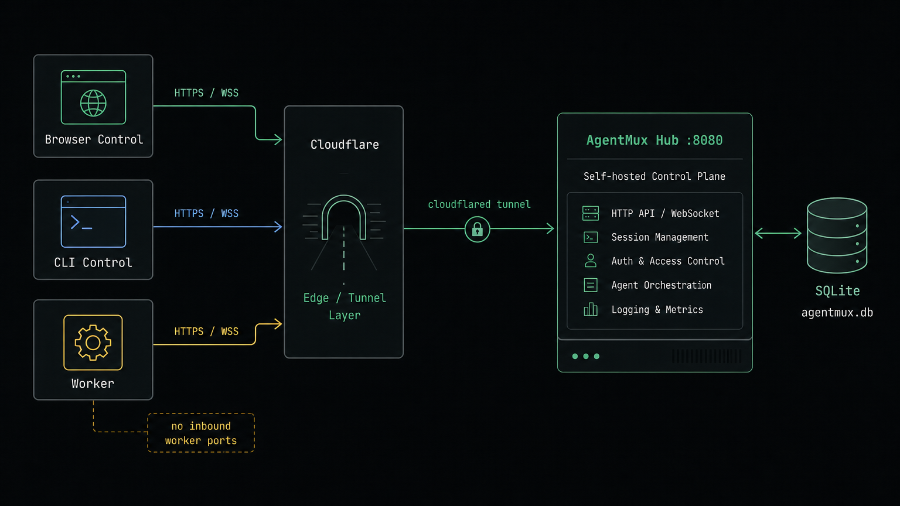

# Deployment

AgentMux Hub is a single Go binary. The production path is to run the Hub on a
server, keep SQLite on local disk, and put HTTPS/WSS in front of it with
Cloudflare Tunnel or another reverse proxy.



## Binary + Cloudflare Tunnel

Install a release binary into `/usr/local/bin/agentmux`, then create config:

```bash
sudo useradd --system --home /var/lib/agentmux --shell /usr/sbin/nologin agentmux
sudo install -d -o agentmux -g agentmux /var/lib/agentmux
sudo install -d /etc/agentmux
sudo install -m 0640 deploy/systemd/agentmux.env.example /etc/agentmux/agentmux.env
sudo install -m 0644 deploy/systemd/agentmux.service /etc/systemd/system/agentmux.service
sudo systemctl daemon-reload
sudo systemctl enable --now agentmux
```

For a named Cloudflare Tunnel or another reverse proxy with your own hostname,
edit `/etc/agentmux/agentmux.env`:

```text
AGENTMUX_TOKEN=change-me-long-random-admin-token
AGENTMUX_PUBLIC_URL=https://hub.example.com
AGENTMUX_DATA=/var/lib/agentmux/agentmux.db
```

Named tunnel setup:

```bash
cloudflared tunnel create agentmux
cloudflared tunnel route dns agentmux hub.example.com
sudo install -m 0644 deploy/cloudflare/config.yml.example /etc/cloudflared/config.yml
cloudflared tunnel run agentmux
```

The Hub must be started with the same public hostname:

```bash
agentmux hub \
  --addr 127.0.0.1:8080 \
  --data /var/lib/agentmux/agentmux.db \
  --public-url https://hub.example.com
```

`--public-url` is what makes generated worker commands use
`wss://hub.example.com`.

For a temporary quick tunnel, the public URL is not known until `cloudflared`
prints it:

```bash
cloudflared tunnel --url http://127.0.0.1:8080
```

Copy the printed `https://*.trycloudflare.com` URL and restart Hub with that
value as `AGENTMUX_PUBLIC_URL` or `--public-url`. If Hub keeps a local
`--public-url`, generated Worker and Control commands will point at
`127.0.0.1` and will not work from other machines.

## Docker Compose

Release tags publish a multi-arch Hub image to GitHub Container Registry:

```bash
docker pull ghcr.io/kinboyw/agentmux:latest
```

Run a released image directly:

```bash
docker run -d --name agentmux --restart unless-stopped -p 8081:8081 ghcr.io/kinboyw/agentmux:latest
```

The image defaults to `hub --addr 0.0.0.0:8081 --data /var/lib/agentmux/agentmux.db`.
Mount `/var/lib/agentmux` only when you want the embedded database to live
outside the container:

```bash
docker run -d --name agentmux --restart unless-stopped -p 8081:8081 -v agentmux-data:/var/lib/agentmux ghcr.io/kinboyw/agentmux:latest
```

For advanced bind mounts, remember the published image runs as the distroless
`nonroot` user (`65532:65532`), so the host directory must be writable by that
UID/GID.

Local compose remains source-build oriented:

Create `.env` from the example:

```bash
cp deploy/agentmux.env.example .env
```

Run:

```bash
docker compose up -d --build
```

The compose file binds Hub to `127.0.0.1:8080` by default. For a named tunnel,
set `AGENTMUX_PUBLIC_URL=https://hub.example.com` in `.env` before starting the
service. For a quick tunnel, start once, run `cloudflared`, copy the generated
URL, update `.env`, and restart the Hub container.

```bash
cloudflared tunnel --url http://127.0.0.1:8080
```

## Generated Install Script

The Hub serves:

```text
GET /install.sh
```

The landing page uses it for one-line worker/control commands:

```bash
curl -fsSL https://hub.example.com/install.sh | sh -s -- worker --join 'amx_sig_...' --name "$(hostname)"
curl -fsSL https://hub.example.com/install.sh | sh -s -- control
```

By default the script downloads release assets from:

```text
https://github.com/kinboyw/agentmux/releases
```

The installer is role-aware: Worker uses `agentmux-worker-${os}-${arch}`,
Control installs the real TUI binary from `agentmux-tui-${os}-${arch}`, and Hub
uses `agentmux-hub-${os}-${arch}`. Control keeps a fallback to older
`agentmux-control-${os}-${arch}` assets, and Worker/Control both keep a fallback
to legacy `agentmux-${os}-${arch}` assets. Windows is currently supported for
the hub-only artifact, for example `agentmux-hub-windows-amd64.tar.gz`.
Downloaded release archives are verified against the matching
`.tar.gz.sha256` asset before installation.

For a Windows Hub-only deployment from an unpacked release or checkout, use the
helper script:

```bat
scripts\run.bat
```

The script looks for `agentmux-hub.exe`, `agentmux-hub-windows-amd64.exe`, or
`agentmux.exe` in the release/check-out root, starts Hub on `127.0.0.1:8081`,
and sets `--public-url https://agentmux.kinboy.wang`. Edit the script before
using a different domain, port, or database path.

Override this at Hub startup if your repo path differs:

```bash
agentmux hub --release-repo your-org/agentmux ...
```

Or override from the client side:

```bash
AGENTMUX_REPO=your-org/agentmux curl -fsSL https://hub.example.com/install.sh | sh -s -- worker --join 'amx_sig_...'
```

## Local Updates

Installed binaries can check and apply release updates from the configured
GitHub repository:

```bash
agentmux version
agentmux update check --role control
agentmux update apply --role control
agentmux update rollback
```

Worker updates can optionally restart the local Worker service after the binary
is staged:

```bash
agentmux update apply --role worker --restart
```

For Hub, Docker deployments should update by replacing the container image.
Binary/systemd deployments can use `agentmux-hub update apply`, then restart the
service manager that owns Hub.

For temporary Control use without changing the installed binary, run from the
verified cache:

```bash
agentmux run control@latest
```

If AgentMux is not installed locally yet, use the Hub-served cached runner:

```bash
curl -fsSL https://hub.example.com/run.sh | sh -s -- control@latest
```

Remove cached runner binaries:

```bash
agentmux cache prune
```

## Data Boundary

SQLite persists:

- anonymous signals
- scoped credentials
- registered users
- browser/TUI device auth sessions
- registered Worker records and software inventory
- Worker update jobs and update events

Runtime state is rebuilt as workers reconnect:

- live Worker connections
- active WebSocket streams
- live session snapshots

Back up `/var/lib/agentmux/agentmux.db` for Hub identity state.
