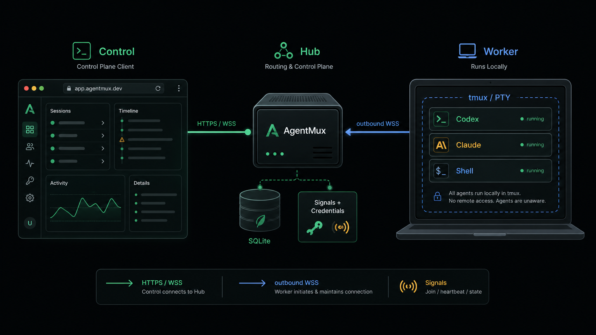
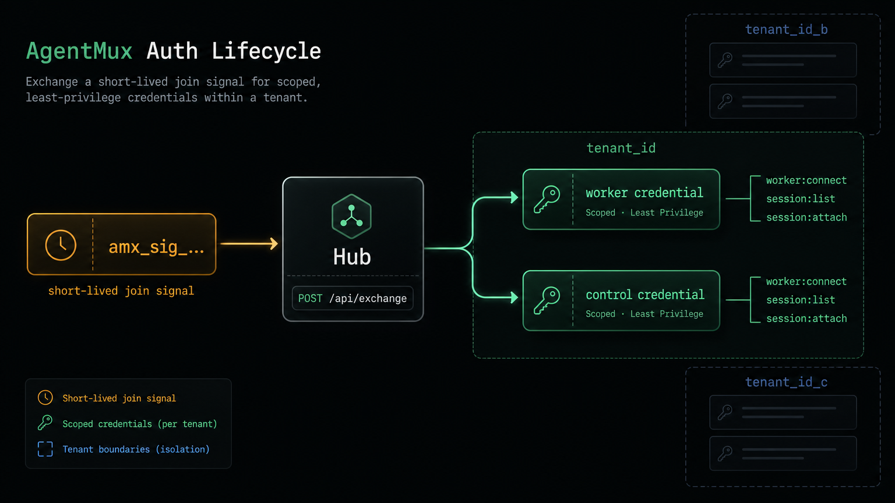
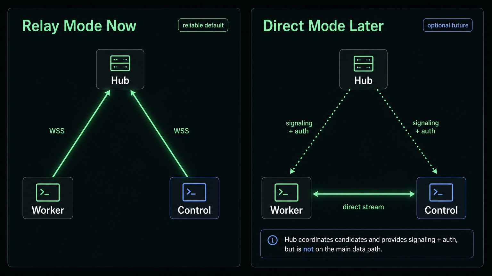

# Product Architecture

## Product Goal

AgentMux should feel like a ZeroTier-style control plane for coding agents:

1. Open the Hub landing page.
2. Generate a short-lived Worker signal and a scoped Direct Token.
3. Paste a one-line command on a worker machine.
4. Open the generated Web Control share URL or use the Direct Token from TUI.
5. Manage long-lived agent sessions without the agent knowing anything about
   remote access.

The core invariant remains:

> Workers own local tmux/PTY state. Hub coordinates identity, discovery, routing,
> and policy. Control renders and operates sessions.

Terminal access is the first runtime capability, not the only one. The same
Hub, Worker, and Control model can later manage adjacent agent-runtime concerns
such as AI API gateway policy and local agent configuration, because those
concerns share the same tenant, device, audit, and enforcement boundaries.



## Roles

### Hub

Hub is the product entrypoint.

- Landing page.
- Anonymous short-lived join signals.
- Registered-user workspace and policies.
- Worker enrollment.
- Control enrollment.
- WebSocket routing.
- Optional terminal-state service for Plan B.
- Deployment command generator.
- Future AI gateway and agent configuration control plane.

Hub should be deployable behind a reverse proxy with HTTPS/WSS. Later it can
serve TLS directly.

Current deployment flags:

```bash
agentmux hub --addr 127.0.0.1:8080 --data ./agentmux.db --public-url https://hub.example.com
```

- `--data` enables SQLite persistence for identity bootstrap state.
- `--public-url` makes generated commands stable behind Cloudflare Tunnel,
  Cloudflare Proxy, Caddy, Nginx, or another TLS terminator.
- With `cloudflared tunnel --url`, the public `trycloudflare.com` URL is known
  only after `cloudflared` starts. Hub should be restarted with that URL before
  generating Worker and Control commands.
- Without `--data`, Hub keeps the development in-memory auth store.

### Worker

Worker is an outbound connector.

- Joins a hub using a short-lived signal or registered-user token.
- Maintains a long-lived device identity after enrollment.
- Reports local terminal sessions.
- Creates, attaches, resizes, and stops tmux-backed or built-in PTY agent sessions.
- Keeps an outbound Hub control channel for enrollment, signaling, policy, and
  revocation. Terminal streams should prefer direct P2P transport and fall back
  to Hub relay when direct negotiation is unavailable or fails.
- Applies Hub-issued runtime configuration for local agent tools, including AI
  provider routing, environment variables, config files, and local gateway
  endpoints.

### Control

Control is the user-facing client. It should have multiple implementations:

- Go CLI for debugging and emergency access.
- Web control as the main product surface.
- Future native/mobile control clients if useful.
- Future admin surfaces for AI gateway keys, model routing, quotas, and
  Worker-side configuration rollout.

The browser control should become the primary user experience because it can
render with xterm.js and place UI outside the terminal buffer.

### Web Control Direction

The production web control should be a modern standalone frontend embedded by
the Go Hub for one-command deployment.

Stack:

- React + TypeScript.
- Tailwind CSS.
- shadcn/ui-style primitives.
- xterm.js for terminal rendering.
- resizable pane layout for multi-session work.

Implemented UX:

- Collapsible navigation/sidebar.
- Multi-pane session layout with draggable resize handles.
- Multiple concurrently attached sessions.
- Login/register flow that returns scoped control credentials.
- Direct Token mode for anonymous shared-session access.
- GitHub and Google OAuth entry points behind provider-specific API routes.
- UI status, auth, and session metadata outside terminal buffers.

Deployment model:

- `web/control` is the source frontend.
- `web/control/dist` is copied into `internal/hub/webdist`.
- Hub serves `/control` and `/assets/*` from embedded files.
- Development can still run Vite with API/WS proxy to the local Hub.

Current implementation boundary:

- Registered users can be stored in Hub memory or SQLite.
- Password hashing is a development placeholder using standard-library SHA-256.
- GitHub/Google OAuth routes exist and return a structured "not configured"
  response until provider config and callback handling are implemented.
- Direct Token access is intentionally limited to listing shared sessions,
  opening an existing session stream, and switching sessions. It cannot create
  or stop sessions, generate join signals, list or manage Workers, load
  previews, use workspaces, or trigger version/update features.
- Production auth should add persistent storage, password KDF such as Argon2id
  or external identity only, secure cookies/session rotation, CSRF protection,
  revocation, audit logs, and tenant/workspace policy enforcement.

SQLite is the near-term default because it matches the one-binary deployment
goal. For Cloudflare, the recommended first-class path is:

```text
Browser/Worker/Control -> Cloudflare HTTPS/WSS -> cloudflared tunnel -> Go Hub -> SQLite
```

Cloudflare D1 is a later option for a Workers/Pages-native control plane or an
HTTP storage service. It is not the simplest persistence backend for the current
Go binary because D1 is exposed inside Cloudflare Workers rather than as a local
SQLite file.


## Onboarding Model

### Anonymous Flow

Anonymous users can generate a temporary Worker join signal and a Control
Direct Token from the Hub landing page.

Properties:

- Short TTL, for example 10 minutes.
- Limited scope.
- Worker signal and Direct Token are tenant-scoped.
- No durable account ownership.
- Good for local demos, trusted personal machines, and quick trials.
- When the anonymous Control Direct Token expires, Hub treats the anonymous
  tenant as expired. Any anonymous Workers still registered under that tenant
  are evicted from Hub state, and live Worker/Control WebSocket connections are
  interrupted so abandoned shares do not keep accumulating runtime resources.

Signal shape:

```text
amx_sig_<random>
```

Hub stores only a hash of the signal token plus metadata:

```text
id
token_hash
tenant_id
expires_at
uses_remaining
scopes
created_ip
created_at
```

Initial scopes:

- `worker:join`
- `control:join`

The landing page presents URLs as links with copy actions, and tokens/commands
as code blocks with copy actions. The generated Web Control share URL carries
the Direct Token:

```text
https://hub.example.com/control?token=amx_cred_xxx
```

The matching TUI path is:

```bash
agentmux-tui --hub https://hub.example.com --token 'amx_cred_xxx'
```

Anonymous cleanup rule:

```text
if tenant_id starts with "anon_"
and there is no active control credential for that tenant
then interrupt tenant runtime:
  - close live Worker connections
  - close live Control connections
  - remove Worker registry records
  - remove Worker update jobs/events for that tenant
```

This intentionally keys lifecycle to the Control share, not to the Worker
connection. If the Direct Token or share URL is lost, the anonymous Worker is no
longer recoverable by that Control path and should be removed automatically
after expiry. Registered tenants are not subject to this cleanup rule.

### Registered Flow

Registered users get the full management surface and stronger controls.

Capabilities:

- persistent workers
- stable Worker installation identity through `worker_instance_id`
- multiple controls
- Web Control workspaces
- access policies
- audit logs
- session history
- worker labels
- team sharing
- Worker enable/disable, eviction, and update orchestration

Registered users should still use short-lived join signals for new Workers, but
the generated signal is attached to the registered tenant. Control devices can
use browser sign-in, device login, or generated Direct Tokens depending on the
desired access boundary.

The current prototype exposes:

```text
POST /api/auth/register
POST /api/auth/login
GET  /api/auth/me
POST /api/auth/refresh
POST /api/auth/device/start
POST /api/auth/device/poll
POST /api/auth/device/approve
GET  /api/auth/oauth/{github|google}
GET  /api/auth/oauth/{github|google}/callback
```

Register/login and OAuth callbacks issue control credentials for the user's
tenant. Google and GitHub OAuth are enabled by provider client id/secret
environment variables on Hub.

## Control-Worker P2P Direction

Direct Control-Worker transport should be the preferred data path. Hub relay is
the compatibility fallback for NAT, Cloudflare Tunnel, corporate networks,
mobile browsers, or any failed direct negotiation. This keeps terminal bytes off
the Hub whenever possible without weakening Hub ownership or cleanup semantics.

Target shape:

```text
Control -> Hub: authenticate and request session attach
Worker  -> Hub: authenticate and advertise P2P capability
Hub     -> both: issue short-lived attach grant and connection hints
Control <-> Worker: direct encrypted terminal stream when negotiation succeeds
Hub     -> both: interrupt/revoke when policy, tenant expiry, or eviction changes
Control -> Hub -> Worker: relay terminal stream when direct negotiation fails
```

Design constraints:

- Hub remains the source of truth for tenant identity, Worker membership,
  session discovery, and policy. P2P is the preferred data plane, not an
  ownership model.
- Control should attempt P2P first for every attach when both endpoints advertise
  compatible direct-mode capabilities. Relay should be selected only when direct
  mode is disabled, unsupported, explicitly forced, or negotiation fails within a
  short timeout.
- Every P2P attach must be backed by a short-lived Hub-issued grant containing
  tenant ID, worker ID, session ID, stream ID, expiry, and allowed terminal
  operations.
- Worker must keep a Hub control channel open even while terminal bytes flow
  P2P. Hub uses that channel to interrupt streams, revoke grants, evict
  anonymous Workers, and force fallback to relay.
- Anonymous tenant expiry must interrupt both relay and P2P streams. The same
  cleanup rule used for Direct Token expiry applies: no active anonymous
  Control credential means no valid anonymous Worker runtime.
- If P2P negotiation fails, Control falls back to Hub relay without changing
  the session model.
- Direct Token mode remains limited even over P2P: session list, session
  switching, and terminal attach only. It still cannot create sessions, manage
  Workers, inspect previews, or trigger updates.
- P2P implementation should prefer WebRTC DataChannel for browsers and a
  compatible native transport for TUI. Any TURN/STUN configuration should be
  optional and exposed by Hub as connection hints.
- Direct-mode encryption should bind the Hub-issued grant to the negotiated
  peer identity or fingerprint. WebRTC DTLS is the baseline; a later
  application-level Noise or HPKE envelope can provide additional
  end-to-end-proof against compromised signaling infrastructure.

Control connection state:

```text
idle
authenticating
requesting_attach_grant
probing_direct_capability
negotiating_direct
direct_connected
direct_failed
falling_back_to_relay
relay_connected
interrupted
closed
```

Control UX requirements:

- Show the current transport mode per pane: `direct`, `relay`, `negotiating`,
  `fallback`, or `interrupted`.
- Show the last direct negotiation failure in a compact diagnostic surface, for
  example `ice_timeout`, `grant_expired`, `worker_unsupported`,
  `control_unsupported`, `fingerprint_mismatch`, `datachannel_closed`, or
  `policy_revoked`.
- Do not block terminal attach on perfect direct connectivity. After the direct
  timeout, attach through relay and keep the user in the same session.
- Keep the negotiated transport mode and fallback reason outside the terminal
  buffer so it does not pollute the agent session.
- Expose a debug view with stream ID, grant ID, worker ID, ICE state, selected
  candidate pair if available, relay fallback reason, reconnect count, and last
  interrupt reason.

Logging requirements:

- Hub, Worker, and Control logs must include `tenant_id`, `worker_id`,
  `control_id`, `session_id`, `stream_id`, `grant_id`, `transport_mode`, and
  `attempt` whenever available.
- Hub should log attach grant issuance, direct capability exchange, signaling
  relay, policy interruption, and relay fallback authorization.
- Worker should log direct grant validation, peer fingerprint checks, data
  channel open/close, terminal stream binding, and Hub interrupt handling.
- Control should log every state transition in the connection state machine,
  direct negotiation timing, selected transport, fallback reason, and user-
  visible error message.
- Logs should be structured and correlation-friendly. A single attach attempt
  must be traceable across Control, Hub, and Worker by `stream_id` and
  `grant_id`.

Interrupt semantics:

```text
Hub interrupt reasons:
  - anonymous tenant expired
  - Worker evicted or disabled
  - Control credential expired or revoked
  - Worker credential expired before reconnect
  - tenant policy changed
  - duplicate Worker instance conflict

Required effect:
  - relay stream: close Hub WebSocket subscription and Worker stream
  - P2P stream: revoke attach grant and send interrupt over Hub control channel
  - Worker: close local stream binding, keep underlying tmux/PTY session alive
    unless the command explicitly requested stop/kill
```

The important product invariant is that losing a Direct Token should not create
an immortal anonymous Worker. Hub must always have a way to revoke or interrupt
both relay and direct P2P paths.

## AI Gateway And Agent Configuration Direction

AgentMux can grow from a terminal control plane into an agent runtime control
plane. Two adjacent capabilities fit the existing architecture:

- AI API gateway: a Hub-managed proxy layer similar in spirit to sub2api-style
  services, with provider keys, model aliases, routing policy, usage accounting,
  and audit events.
- Agent config switching: a Hub-managed configuration layer similar in spirit to
  cc-switch, but distributed across registered Workers instead of being a
  single-machine tool.

The goal is not to couple AgentMux to one AI vendor, editor, or agent. The goal
is to give the operator one place to manage runtime policy for machines that
already trust AgentMux Worker.

### Gateway Model

The AI gateway should be a separate capability, not part of the terminal stream.
Hub owns configuration and policy; the gateway data plane can be deployed in
more than one shape:

```text
agent process -> local Worker gateway -> upstream AI provider
agent process -> Hub gateway endpoint   -> upstream AI provider
agent process -> external gateway       -> Hub-managed config/policy
```

Recommended progression:

1. Hub stores provider definitions, model aliases, routing rules, and redacted
   secrets.
2. Control manages those resources with tenant-scoped RBAC and audit logs.
3. Worker receives an effective gateway config over the existing control
   channel.
4. Worker exposes a local OpenAI-compatible endpoint, for example
   `127.0.0.1:<port>/v1`, and injects `OPENAI_BASE_URL`/`OPENAI_API_KEY` into
   managed sessions.
5. Hub aggregates usage and health reported by Workers.
6. Optional Hub-hosted gateway mode can proxy traffic centrally when local
   gateways are not desirable.

Keeping a local Worker gateway as the first implementation has pragmatic
benefits:

- agent traffic does not have to hairpin through Hub;
- existing terminal/session ownership maps naturally to local env injection;
- per-machine network constraints and provider endpoints can differ;
- Hub remains the source of truth for policy without becoming a mandatory
  high-throughput LLM proxy.

### Config Switching Model

cc-switch-style behavior should become a managed Worker capability:

```text
Control -> Hub: update config profile / rollout rule
Hub -> Worker: config.apply(profile, revision)
Worker: validate, stage, write local config, reload affected sessions if allowed
Worker -> Hub: config.applied / failed with logs
```

Profiles should be explicit and revisioned:

- provider profile: base URLs, model aliases, default model, fallback model;
- secret reference: never expose raw provider secrets to Direct Token controls;
- environment profile: variables injected into new sessions;
- file profile: generated files such as Claude/Codex config fragments;
- rollout rule: target Workers, labels, workspaces, or sessions;
- reload policy: new sessions only, restart Worker-managed process, or manual.

Worker-side apply must be conservative:

- validate config before writing;
- write atomically with backup and rollback metadata;
- report exact file paths and revision IDs, but redact secret values;
- never mutate unrelated user files outside configured roots;
- avoid restarting long-running sessions unless the operator explicitly chooses
  that policy.

### Security And Product Boundaries

AI gateway and config switching are higher-risk than terminal attach because
they manage secrets and agent behavior. They should require registered Control
credentials, not anonymous Direct Tokens.

Minimum boundaries:

- tenant-scoped provider secrets encrypted at rest or stored via an external
  secret backend;
- audit events for create/update/delete/apply/revoke;
- Worker capability flags such as `ai.gateway.local.v1` and
  `agent.config.apply.v1`;
- Worker labels and policy filters before rollout;
- dry-run/preview diff in Control before applying config;
- emergency revoke that disables a profile and interrupts affected local
  gateway credentials.

This should remain additive to terminal control. A Worker that does not
advertise AI gateway/config capabilities should continue to work as a terminal
Worker.

### Signal Exchange

Signals are bootstrap material only. Worker and control clients must exchange a
signal for a scoped credential before using normal HTTP or WebSocket APIs.

```text
POST /api/exchange
{
  "signal": "amx_sig_xxx",
  "role": "worker|control",
  "device_name": "laptop",
  "device_id": "optional-stable-device-id"
}
```

Response:

```json
{
  "credential": "amx_cred_...",
  "credential_id": "cred_...",
  "role": "worker",
  "tenant_id": "anon_...",
  "expires_at": "2026-06-09T12:00:00Z"
}
```

Credentials are tenant-scoped and persisted when Hub runs with `--data`.
Production credentials should add revocation and audit trails.



## Deployment Command

The landing page should generate commands similar to ZeroTier's join flow.

Worker:

```bash
curl -fsSL https://hub.example.com/install.sh | sh -s -- worker \
  --hub wss://hub.example.com \
  --join amx_sig_xxx \
  --name "$(hostname)"
```

Control share:

```bash
agentmux-tui --hub https://hub.example.com --token 'amx_cred_xxx'
```

For local development:

```bash
go run ./cmd/agentmux worker --hub ws://127.0.0.1:8081 --join amx_sig_xxx --name local
```

`--join` performs signal exchange and uses the returned credential as the
runtime bearer token. `--token` remains as a local development/admin override.
Worker keeps a stable local instance id, so the same Worker instance cannot
reuse the same signal by changing only `--name`. If a Worker was accidentally
joined to the wrong Hub, run `agentmux worker leave` before joining again.

The `/install.sh` endpoint is intentionally conservative: it uses an existing
role binary from `PATH`, builds from source when run inside a checkout, or
downloads the matching role-specific Linux/macOS release archive from GitHub.
Control installs a real `agentmux-tui` binary. Release assets are split by role
so Hub can ship as a smaller cross-platform binary; Windows support starts with
`agentmux-hub-windows-amd64.tar.gz` while Worker and terminal Control remain
Linux/macOS until the Windows PTY/service model is implemented.

## Update Model

AgentMux should support both installed updates and `npx`-style cached execution.

- Hub and Worker are service-like roles. They should update through staged,
  verified binaries and explicit restarts. Docker Hub deployments should update
  by replacing the container image rather than mutating binaries inside the
  container.
- Control CLI/TUI can support a faster `agentmux run control@latest` workflow
  that downloads a verified binary into a versioned cache and executes it
  without changing the installed binary.
- Remote Worker update should be Hub-orchestrated and backend-aware. It is safe
  by default for tmux-backed sessions because tmux state survives Worker
  restart, but PTY-backed sessions require a disruptive-restart confirmation.
- Compatibility is capability-driven: Hub, Worker, and Control publish protocol
  versions and capabilities, and UI/API paths degrade when an older endpoint is
  missing an optional capability.

See [In-Place Update Strategy](UPDATE_STRATEGY.md) for the command model,
protocol additions, persistence tables, and rollout phases.

## Trust and Token Model

Use three token classes:

1. Join signal
   - short-lived
   - one-time or limited-use
   - exchanged for device credentials

2. Device credential
   - long-lived
   - scoped to worker/control
   - revocable from Hub

   A Control credential without a user email is treated as a Direct Token. It is
   scoped to shared-session connection and cannot mutate Hub/Worker state.

3. Hub admin token
   - deployment/local-development control plane override
   - never shown in anonymous landing URLs
   - not a normal worker/control runtime credential

## Multi-Tenant Model

Every signal, credential, worker, control, and session should carry a
`tenant_id`.

Anonymous onboarding creates a temporary tenant:

```text
tenant_id = anon_<random>
expires_at = signal expiry or short anonymous workspace TTL
```

Registered onboarding attaches signals and credentials to a durable tenant:

```text
tenant_id = tenant_<id>
user_id = usr_<id>
```

The immediate implementation stores anonymous and registered tenant identity in
memory or SQLite. SQLite-backed Hubs also persist Worker registry records,
software inventory, and Worker update job/event history. Live Worker
connections, active terminal streams, and session snapshots remain runtime state
and are rebuilt as Workers reconnect.

Worker identity uses two layers:

- `worker_id` is the user-facing route key. Session IDs are still
  `<worker_id>/<session_name>`.
- `worker_instance_id` is generated once on the Worker install and survives
  display-name or route-key changes. It is used for audit/update correlation and
  future rename-safe migrations.

## TODO

- Persist workspace layouts, revocations, and broader audit events in SQLite.
- Add credential revocation and expiry cleanup.
- Add worker policy: allowed commands, allowed working directories, max sessions.
- Add session ownership/audit events.
- Add direct-first signaling, encrypted P2P transport, relay fallback, Control
  transport-state UI, and correlation-friendly direct-mode logs.

## Routing Modes

### Direct Mode

Preferred mode.

```text
worker <-> control
hub = signaling + auth + rendezvous + revocation
```

Pros:

- keeps terminal bytes off Hub when possible
- lower latency and bandwidth cost
- preserves Hub as the source of auth, policy, and revocation

Cons:

- NAT traversal can fail
- requires more visible connection-state handling in Control
- needs careful key/fingerprint binding and diagnostic logging

Candidates:

- WebRTC data channel
- same-LAN direct WebSocket
- WireGuard/Tailscale-like private addresses
- QUIC hole punching if needed later

Hub responsibilities in direct mode:

- authenticate both sides
- issue short-lived attach grants
- exchange endpoint candidates
- authorize session access
- interrupt or revoke active direct streams
- authorize relay fallback when direct negotiation fails

### Relay Mode

Fallback mode.

```text
worker -> hub <- control
```

Pros:

- works when direct negotiation fails
- simplest connectivity path
- one public endpoint

Cons:

- hub bandwidth and latency bottleneck
- terminal bytes pass through hub

Relay mode should be automatic and boring: Control reports that it is falling
back, records the reason, and keeps the terminal usable.



## Plan B: Headless Terminal State

Plan B is the path to stable reconnects and perfect UI overlays.

Recommended stack:

- Browser control: TypeScript + xterm.js.
- Headless terminal state: `@xterm/headless` + `@xterm/addon-serialize`.
- Hub or sidecar consumes terminal bytes and maintains screen state.

Benefits:

- reconnect snapshot
- no scrollback pollution
- DOM overlay status bars
- tabs and split panes
- multi-control fanout
- eventual replay/session history

The target render mode is `worker_state_xterm`:

```text
Worker keeps canonical terminal state.
Control coordinates attach, resize, history paging, and bottom alignment.
xterm.js remains the final visible renderer for the live terminal.
```

This mode is mutually exclusive with `live_attach_xterm`. Worker-state mode
should send current ANSI snapshots and live xterm-compatible updates, while lazy
history pages are rendered on demand outside xterm scrollback. `cells-v1` and
row diffs are diagnostic/validation tools unless explicitly requested; they
should not run in parallel with the production xterm path by default.

Worker state and Control view state are intentionally separate. Worker owns the
canonical terminal state, target identity, generation, and remote terminal size.
Each Control owns only its local viewport, scroll/history anchors, and rendering
position. Normal Control layout changes must not resize the remote tmux/PTY in
worker-state mode; remote size changes require explicit sync/reset operations so
multiple Controls do not fight over terminal geometry.

This separation is about local view state, not about disabling remote control.
Control still sends explicit terminal input and tmux operations through Worker.
Those command-plane operations are allowed to mutate the remote session and are
then reflected back through Worker-owned snapshots, live updates, history, and
generation boundaries.

The Go CLI should remain a debug tool. The product-grade control should be web.

## Initial Implementation Plan

1. Add Hub landing page. Done.
2. Add anonymous signal generation endpoint. Done.
3. Show one-line worker and control commands. Done.
4. Add `--join` exchange flow to worker/control CLI. Done.
5. Add basic in-memory signal and credential stores. Done.
6. Add browser control shell with xterm.js. Done.
7. Vendor web assets and split static files. Done.
8. Persist auth/device state in SQLite. Done for signals, credentials, users.
9. Add headless terminal state sidecar.

## Automation

GitHub Actions now provide two tracks:

- CI on pushes and pull requests: Go tests, Web Control build, binary build.
- Release on `v*` tags: role-specific Linux/macOS tarballs plus Hub-only Windows artifacts.
- Docker image publishing on `v*` tags: multi-arch Linux images are pushed to `ghcr.io/kinboyw/agentmux`.

The release build rebuilds Web Control and embeds it into `internal/hub/webdist`
before compiling the Go binary.
